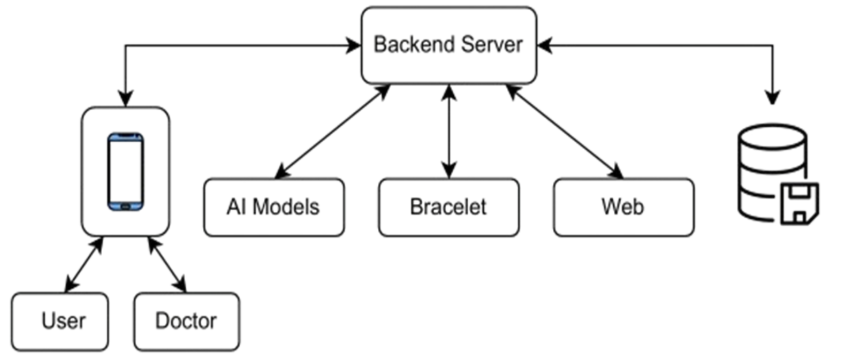
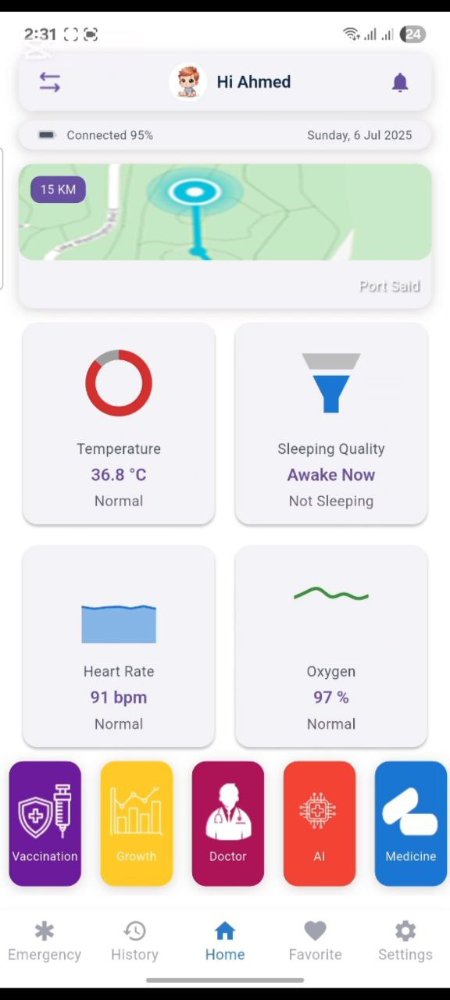
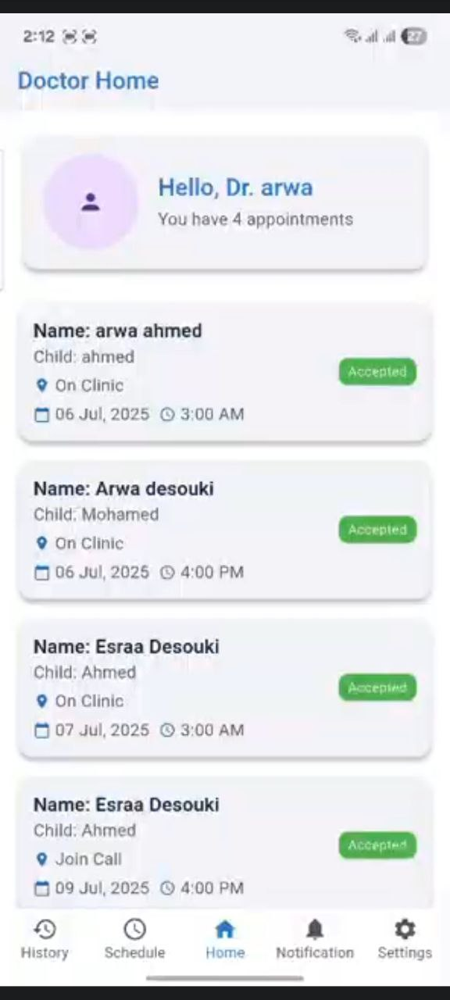
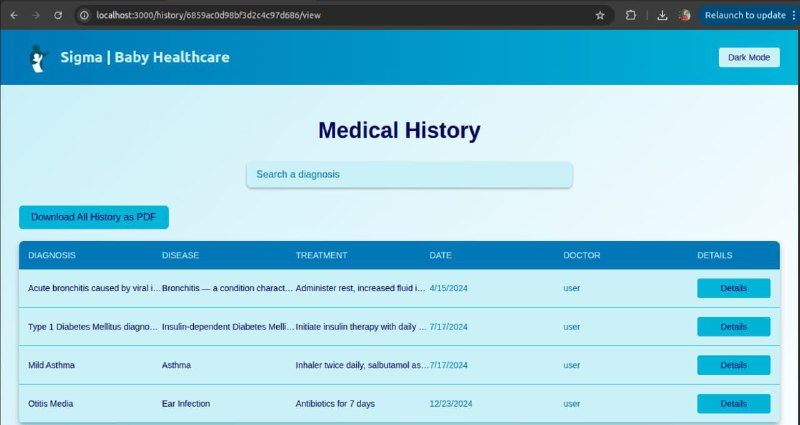
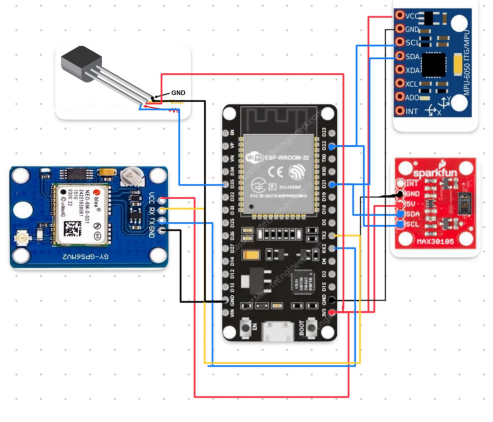
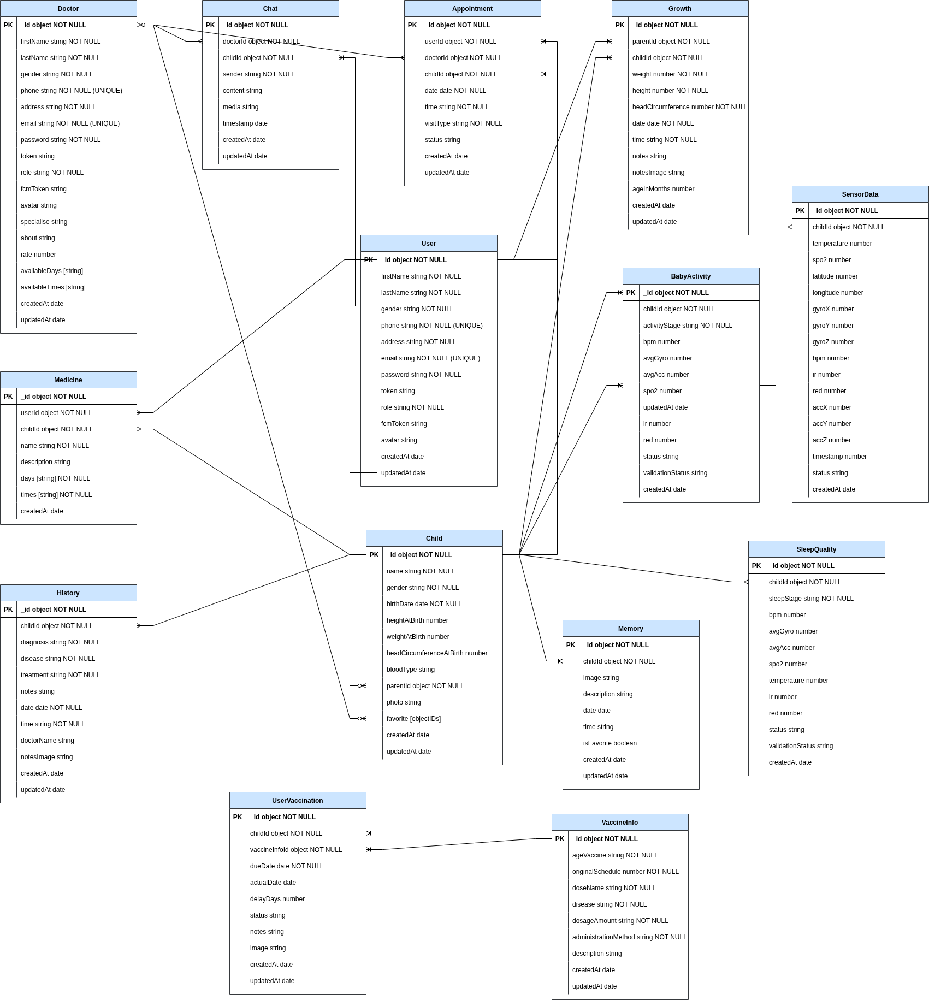
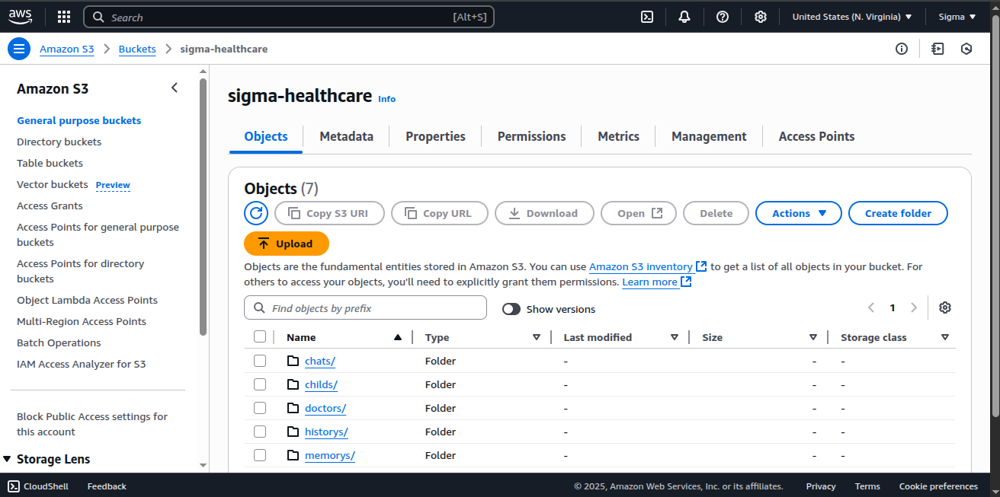
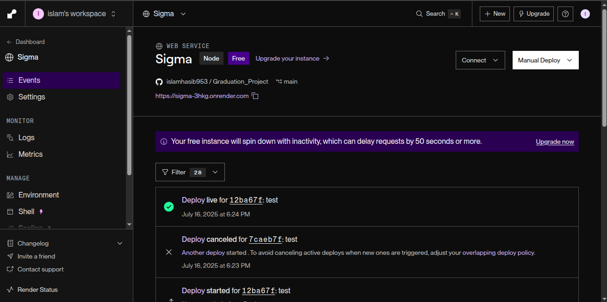
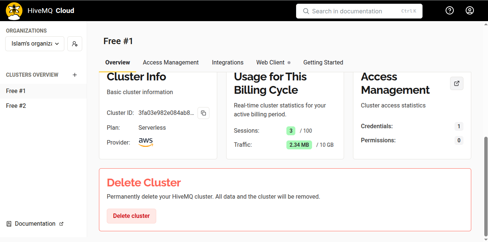
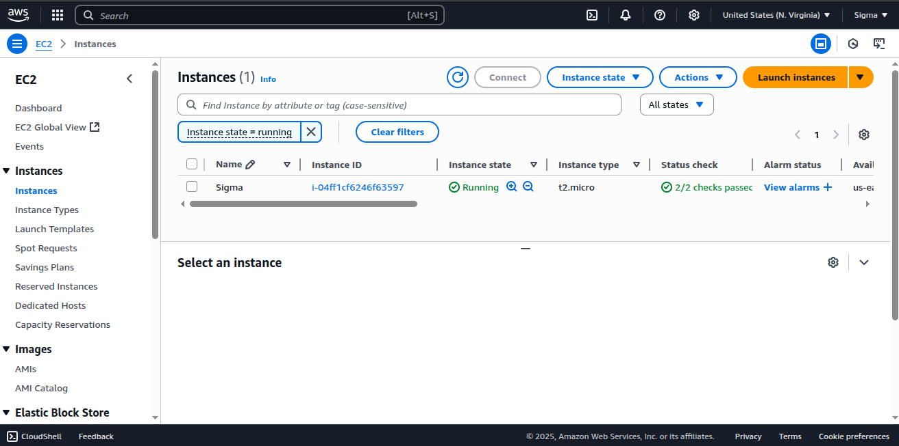

# SmartBrace(Sigma): Pediatric Healthcare Monitoring System

## Introduction

SmartBrace(Sigma) is a comprehensive pediatric healthcare solution that empowers parents and doctors to monitor and manage children's health and safety in real-time. The system integrates a smart wearable bracelet, a cross-platform Flutter mobile application, and a React-based web platform to provide seamless health tracking, medical history management, and emergency response capabilities. With advanced hardware, a robust backend infrastructure, and AI-driven analytics, SmartBrace(Sigma) ensures continuous monitoring of vital signs, activity levels, and location, offering caregivers valuable insights and peace of mind.

- SmartBrace(Sigma) System Overview
  

_This image shows the complete SmartBrace(Sigma) ecosystem, including the smart bracelet, mobile app interface (parent dashboard), and web platform._

## Features

### Mobile Application (Flutter)

The Flutter-based mobile app supports two user roles: **Parents** (Users) and **Doctors**, each with tailored functionalities.

#### Parent Features

- **User Registration and Authentication**: Parents can register and log in using email and password. Passwords are securely encrypted with `bcryptjs`, and authentication/authorization is managed with `jsonwebtoken` for secure access control.
- **Multi-Child Management**: Create and manage profiles for multiple children, each linked to their unique SmartBrace(Sigma) device with health and activity data.
- **Real-Time Health Monitoring**: Displays live data from the SmartBrace(Sigma) wearable, including:
  - Blood oxygen saturation (SpO₂)
  - Heart rate
  - Body temperature
  - Sleep quality
  - Activity levels (resting, walking, running, sleeping)
  - Location tracking via GPS
- **Child Profile Management**: Edit child profiles and generate PDF cards with medical information for sharing or printing.
- **Growth Tracking**: Monitor and update growth metrics (height, weight, head circumference) with interactive charts for visualization.
- **Medical History**: Maintain and update a child’s medical history, accessible and editable within the app.
- **Medication Management**: Add medications with scheduled reminders via push notifications for timely administration.
- **Doctor Booking**: Browse available doctors, view profiles, and book appointments (online, at home, or at the clinic). Appointment statuses (pending, accepted, rejected) update in real-time with notifications.
- **Secure Doctor Chat**: Communicate with doctors via a secure chat feature, activated only after an appointment is accepted.
- **Favorite Doctors**: Save preferred doctors for quick access.
- **Memories**: Upload and manage photos or milestones for each child.
- **AI-Powered Features**:
  - **Medical Chatbot**: Ask a medical chatbot for reliable health advice.
  - **Disease Prediction**: Answer behavior-specific questions for three conditions (e.g., fever, asthma, allergies). The AI evaluates responses and provides a yes/no prediction for each.
- **Vaccination Tracking**: Manage Egyptian vaccination schedules with reminders for upcoming doses. Tracks taken, overdue, or delayed vaccinations, adjusting future schedules accordingly.
- **Theme Customization**: Switch between light and dark themes for a personalized experience.

- Parent Dashboard
  

_This is a screenshot of the parent dashboard in the Flutter app, showing real-time health data (SpO₂, heart rate, etc.), child profile options, and growth charts._

#### Doctor Features

- **Doctor Dashboard**: Displays the doctor’s profile picture, name, and number of accepted appointments.
- **Appointment Management**: View, accept, or reject appointment requests. Rejected appointments are automatically removed.
- **Availability Settings**: Update available appointment slots.
- **Child Medical Data Access**: Use a child’s unique ID to view medical history, growth charts, and health metrics.
- **Profile Management**: Edit personal profile details.
- **Notifications**: Receive real-time updates on appointment requests and statuses.

- Doctor Dashboard
  

_This is a screenshot of the doctor dashboard, highlighting appointment management, child medical data, and profile details._

### Web Platform (React)

The React-based web platform is designed for emergency scenarios:

- **NFC Card Integration**: Each child has an NFC card linked to their medical history. Doctors can scan it in clinics or hospitals to access critical health information for rapid treatment.

- web medical history
  
  _This image shows the web platform displaying a child’s medical history accessed via NFC card scan._

### SmartBrace(Sigma) Hardware

The SmartBrace(Sigma) wearable is a compact, child-friendly device with sensors for real-time health and activity monitoring. Key components include:

- **ESP32 Microcontroller**: The central unit with built-in Wi-Fi for MQTT-based data transmission.
- **MAX30105 Sensor**: Measures heart rate and SpO₂ via I2C protocol.
- **TMP36 Temperature Sensor**: Estimates body temperature through skin contact.
- **MPU6050 Gyroscope and Accelerometer**: Tracks activity and sleep quality.
- **NEO-6M GPS Module**: Provides real-time location tracking via UART.
- **Data Transmission**: Sends sensor data to the backend via MQTT for processing and storage.

- Hardware Bracelet
  

_This image illustrates the SmartBrace(Sigma) wearable design and sensor placement._

## Technology Stack

### Frontend

- **Mobile App**: Flutter for cross-platform iOS and Android development, ensuring a consistent user experience.
- **Web Platform**: React with Tailwind CSS, using JSX and modern JavaScript with Babel for a responsive and scalable interface.

### Backend

- **Main Server**: Node.js with Express, hosted on AWS EC2 (Ubuntu) and managed with PM2 for process monitoring and reliability, located in the `/backend` folder.
- **Security**:
  - Passwords are encrypted using `bcryptjs` for secure storage.
  - Authentication and authorization are handled with `jsonwebtoken` for secure user sessions.
- **Database**: MongoDB stores system data efficiently. The database structure includes collections for user profiles, child health data, and medical history.
  
  _This diagram shows the MongoDB database structure, including collections for user profiles, child health data, and medical history._
- **File Storage**: AWS S3 is used to store images and files, with corresponding URLs saved as strings in MongoDB.
  
  _This image depicts the process of uploading files to AWS S3 and storing their URLs in the MongoDB database._
- **Microservice**: FastAPI (Python) handles AI-driven features, implemented in `/backend/fastapi_service` and hosted on Render.
  
- **Real-Time Data**: MQTT with HiveMQ Cloud broker uses the `sensors/data` topic for sensor-server communication.
  
  _This image illustrates the HiveMQ Cloud broker structure, including the `sensors/data` topic configuration._
- **WebSocket**: Enables real-time data updates to the mobile app with latency under 5 seconds.
- **Algorithms**: Includes backend algorithms for data validation, sleep quality analysis, and activity level computation based on MPU6050 sensor data.

### Hardware

- **Microcontroller**: ESP32 for processing and Wi-Fi communication.
- **Sensors**:
  - MAX30105 (Heart Rate & SpO₂, I2C)
  - TMP36 (Temperature, Analog)
  - MPU6050 (Gyroscope & Accelerometer, I2C)
  - NEO-6M (GPS, UART)
- **Communication**: MQTT for real-time data transmission to the backend.

### AI

- **Medical Chatbot**: Provides reliable responses to health-related queries.
- **Disease Prediction**: Evaluates user responses to behavior-specific questions for three conditions (e.g., fever, asthma, allergies), delivering a yes/no prediction for each.

## Data Flow

1. **Hardware to Backend**:
   - Sensors publish data to the `sensors/data` topic via MQTT using the HiveMQ Cloud broker.
   - The Node.js server, subscribed to the same topic, receives the data, validates it using backend algorithms, and stores it in MongoDB.
   - Validated data is pushed to the mobile app via WebSocket, ensuring updates in under 5 seconds.
2. **Mobile/Web to Backend**:
   - The Flutter app and React web platform send HTTP requests to the Node.js server.
   - Uploaded files (e.g., images, PDFs) are stored in AWS S3, with URLs saved in MongoDB for retrieval.
3. **AI Processing**:
   - AI requests are routed from the Node.js server to the FastAPI microservice folder at `/backend/fastapi_service`.
   - The microservice processes the request using AI models and returns responses to the Node.js server, which forwards them to the client.

## Installation and Setup

### Prerequisites

- **Node.js**: Version 20.x
- **Flutter**: Latest stable version
- **React**: Node.js with npm
- **MongoDB**: Local or cloud instance
- **AWS Account**: For EC2 and S3 services
- **Render Account**: For FastAPI microservice deployment
- **HiveMQ Cloud**: For MQTT broker
- **Arduino IDE or PlatformIO**: For ESP32 programming

### Backend Setup (Node.js)

1. Clone the repository:
   ```bash
   git clone <repository-url>
   cd <repository-root>
   ```
2. Navigate to the backend folder:
   ```bash
   cd backend
   ```
3. Install dependencies:
   ```bash
   npm install
   ```
4. Create a `.env` file with the following variables (replace with your own values):
   ```env
   PORT=<your-port>
   TOKEN_SECRET_KEY=<your-jwt-secret>
   DATA_BASE_URL=mongodb+srv://root:<your-password>@gradulateproject.l52su.mongodb.net/<your-database-name>?retryWrites=true&w=majority&appName=GradulateProject
   DATA_BASE_NAME=<your-database-name>
   DATA_BASE_PASSWORD=<your-password>
   # mqtt
   MQTT_HOST=<your-mqtt-host>
   MQTT_PORT=<your-mqtt-port>
   MQTT_USERNAME=<your-mqtt-username>
   MQTT_PASSWORD=<your-mqtt-password>
   MQTT_TOPIC=sensors/data
   # ai
   FASTAPI_URL=<your-fastapi-url>
   # firebase when run server local
   FIREBASE_CREDENTIALS_PATH=<your-firebase-credentials-path>
   # firebase when run server in vercel
   FIREBASE_TYPE=<your-firebase-type>
   FIREBASE_PROJECT_ID=<your-firebase-project-id>
   FIREBASE_PRIVATE_KEY_ID=<your-firebase-private-key-id>
   FIREBASE_PRIVATE_KEY=<your-firebase-private-key>
   FIREBASE_CLIENT_EMAIL=<your-firebase-client-email>
   FIREBASE_CLIENT_ID=<your-firebase-client-id>
   FIREBASE_AUTH_URI=<your-firebase-auth-uri>
   FIREBASE_TOKEN_URI=<your-firebase-token-uri>
   FIREBASE_AUTH_PROVIDER_X509_CERT_URL=<your-firebase-auth-provider-x509-cert-url>
   FIREBASE_CLIENT_X509_CERT_URL=<your-firebase-client-x509-cert-url>
   FIREBASE_UNIVERSE_DOMAIN=<your-firebase-universe-domain>
   # S3
   AWS_ACCESS_KEY=<your-aws-access-key>
   AWS_SECRET_KEY=<your-aws-secret-key>
   AWS_S3_BUCKET=<your-s3-bucket>
   AWS_REGION=<your-aws-region>
   ```
5. Run the server:
   ```bash
   npm start
   ```
   For development with auto-restart:
   ```bash
   npm run dev
   ```
6. Deploy on AWS EC2:
   - Set up an Ubuntu instance.
   - Install PM2: `npm install -g pm2`
   - Start the server: `pm2 start index.js`
     
     _This image shows the AWS EC2 setup, including the Ubuntu instance configuration and PM2 deployment for the Node.js server._

### FastAPI Microservice Setup

1. Navigate to the microservice folder within the repository:
   ```bash
   cd backend/fastapi_service
   ```
2. Install dependencies:
   ```bash
   pip install -r requirements.txt
   ```
3. Configure environment variables for AI models and Node.js server communication within the `.env` file in the root `/backend` folder.
4. Deploy on Render:
   - Push the repository to Render and configure the service with the appropriate Python version, ensuring the `/backend/fastapi_service` folder is included.

### Mobile App Setup (Flutter)

1. Navigate to the Flutter app folder:
   ```bash
   cd Sigma_App
   ```
2. Install dependencies:
   ```bash
   flutter pub get
   ```
3. Configure Firebase for push notifications:
   - Add `google-services.json` (Android) and `GoogleService-Info.plist` (iOS) to the project.
4. Run the app:
   ```bash
   flutter run
   ```
5. Build for release:
   ```bash
   flutter build apk  # For Android
   flutter build ios  # For iOS
   ```

### Web Platform Setup (React)

1. Navigate to the web app folder:
   ```bash
   cd frontend/sigma_web_app
   ```
2. Install dependencies:
   ```bash
   npm install
   ```
3. Configure environment variables for API endpoints and NFC integration.
4. Run the development server:
   ```bash
   npm start
   ```
5. Build for production:
   ```bash
   npm run build
   ```

### Hardware Setup (ESP32)

1. Connect the sensors to the ESP32:
   - **MAX30105**: I2C (SDA: GPIO21, SCL: GPIO22)
   - **MPU6050**: I2C (SDA: GPIO21, SCL: GPIO22)
   - **TMP36**: Analog input pin
   - **NEO-6M**: UART (RX: GPIO16, TX: GPIO17)
2. Install the Arduino IDE or PlatformIO.
3. Include the required libraries:
   ```cpp
   #include <WiFi.h>
   #include <PubSubClient.h>
   #include <ArduinoJson.h>
   #include <MAX30105.h>
   #include <heartRate.h>
   #include <spo2_algorithm.h>
   #include <MPU6050_light.h>
   #include <TinyGPS++.h>
   #include <HardwareSerial.h>
   ```
4. Configure Wi-Fi and MQTT settings:
   ```cpp
   const char* ssid = "Sheetos";
   const char* password = "#2222#88888#";
   const char* mqtt_server = "<your-mqtt-host>";
   const int mqtt_port = <your-mqtt-port>;
   ```
5. Upload the code to the ESP32 using the Arduino IDE or PlatformIO.
6. Ensure the device publishes to the `sensors/data` topic via the MQTT broker.

## Usage Guidelines

### For Parents

1. **Sign Up/Log In**: Register using email and password. Passwords are encrypted with `bcryptjs`, and `jsonwebtoken` ensures secure authentication.
2. **Add Children**: Create profiles for each child, linking their SmartBrace(Sigma) device ID.
3. **Monitor Health**: View real-time data (SpO₂, heart rate, temperature, activity, location) on the app.
4. **Manage Profiles**: Edit child or parent profiles, generate PDF cards, and track growth or medical history.
5. **Book Appointments**: Browse doctors, check availability, and book appointments. Chat with doctors once approved.
6. **Track Vaccinations**: Manage vaccination schedules with reminders for upcoming doses.
7. **Use AI Features**: Query the medical chatbot or answer behavior-specific questions for disease prediction.
8. **Add Memories**: Upload photos or milestones for each child.

### For Doctors

1. **Sign Up/Log In**: Register as a doctor and set up your profile, secured with `bcryptjs` and `jsonwebtoken`.
2. **Manage Appointments**: Accept or reject appointment requests and update availability.
3. **Access Child Data**: Use a child’s ID to view medical history and growth charts.
4. **Communicate**: Chat with parents after accepting appointments.

### For Emergency Use (Web)

1. **Scan NFC Card**: In emergencies, scan the child’s NFC card to access their medical history.
2. **View Data**: Review critical health information for accurate treatment.

## Contributing

We welcome contributions to enhance SmartBrace(Sigma). To contribute:

1. Fork the repository.
2. Create a feature branch: `git checkout -b feature/your-feature`.
3. Commit changes: `git commit -m 'Add your feature'`.
4. Push to the branch: `git push origin feature/your-feature`.
5. Submit a pull request.

## License

This project is licensed under the MIT License. See the `LICENSE` file for details.

## Links

- Project Video: [Project Video](https://drive.google.com/drive/folders/1Jn1qQUtVc6qBG5No9ZdM82Yq6xanXNH6?usp=sharing)
- Figma file: [Figma File](https://www.figma.com/design/O8No0tgUO1Xho8b0Yp0DmO/Sigma?node-id=0-1&t=4tZgv7AmBXvHnGvf-1)

## References

- ESP32: [Espressif Systems](https://www.espressif.com)
- MAX30105: [Maxim Integrated](https://www.analog.com)
- MPU6050: [InvenSense](https://invensense.tdk.com)
- NEO-6M: [u-blox](https://www.u-blox.com)
- TMP36: [Analog Devices](https://www.analog.com)
- TinyGPS++: [GitHub](https://github.com/mikalhart/TinyGPSPlus)
- PubSubClient: [GitHub](https://github.com/knolleary/pubsubclient)
- ArduinoJson: [ArduinoJson](https://arduinojson.org)
- SparkFun MAX3010x Library: [GitHub](https://github.com/sparkfun/SparkFun_MAX3010x_Sensor_Library)
- HiveMQ: [HiveMQ](https://www.hivemq.com)
